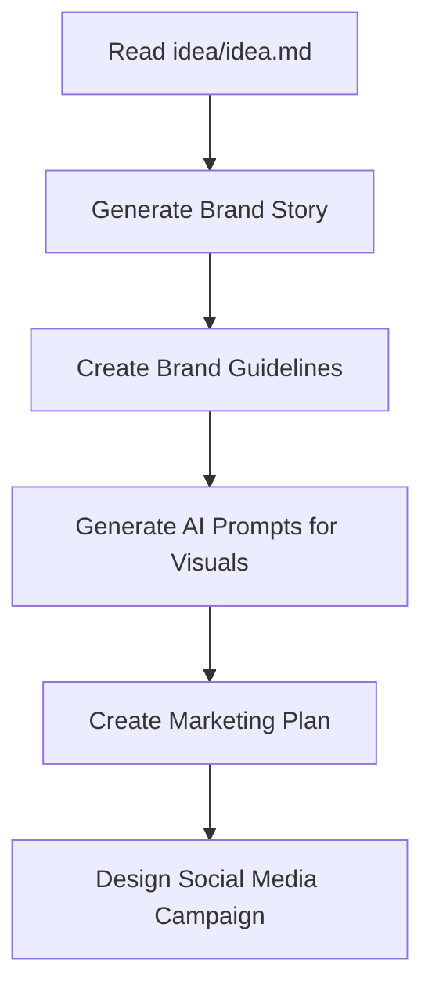

# Brand Development Workflow

This file orchestrates the complete brand development process and optimtion based on the id provided in the idea/idea.md
The pan and everhting here in struged can be adjusted to the overall idea. 
## Workflow Overview



## Instructions for Claude

Execute the following steps in order. Each step builds on the previous one.

---

## Step 1: Read the Core Idea

**Action**: Read `/idea/idea.md` to understand:
- Vision and core objectives
- Strategy (Lean Startup approach)
- Methodology and features
- Target audience and value proposition

**Output**: Internal understanding of the product concept

---

## Step 2: Generate Brand Story

**Action**: Use the `brand-manager` skill to create a comprehensive brand story

**Input**:
- Product concept from idea.md
- Target audience: Knowledge workers (25-45) feeling career stagnation
- Core problem: Busy without growth
- Unique solution: AI-powered growth insights after Pomodoro sessions

**Task**: Create `/idea/brand-story.md` containing:
1. **Brand Purpose** - Why the brand exists
2. **Brand Promise** - What customers can expect
3. **Brand Values** - 3-5 core principles
4. **Brand Personality** - Voice, tone, character
5. **Brand Positioning Statement** - Clear differentiation
6. **Brand Narrative** - Story arc (problem → solution → transformation)
7. **Key Messages** - 3-5 core themes for all communications
8. **Value Proposition** - One-sentence unique value
9. **Tagline Options** - 3-5 memorable phrases
10. **Customer Benefits** - Emotional outcomes (not just features)
11. **Brand Name** - Name of the product. 
**Command**:
```
Using the brand-manager skill, create a comprehensive brand story based on idea input. 
```

---

## Step 3: Create Brand Guidelines

**Action**: Use the `design-advisor` skill to create visual identity guidelines

**Input**:
- Brand story from Step 2
- the idea provided in the file.

**Task**: Create `/idea/brand-guidline.md` containing:

### Visual Identity Guidelines:
1. **Color Palette**
   - Primary colors (with hex codes, RGB, CMYK)
   - Secondary colors
   - Accent colors
   - Neutral colors
   - Color psychology and usage rules
   - Accessibility compliance (WCAG AA minimum)

2. **Typography System**
   - Heading fonts (family, weights, sizes)
   - Body fonts
   - UI fonts
   - Type scale
   - Line heights and spacing
   - Web font recommendations

3. **Logo System**
   - Logo concepts and symbolism
   - Primary logo specifications
   - Logo variations (full, mark-only, wordmark)
   - Clear space rules
   - Size requirements
   - Usage do's and don'ts

4. **Imagery Style**
   - Photography direction (mood, composition, subject matter)
   - Illustration approach
   - Image treatment and filters
   - What to avoid

5. **Design Elements**
   - Iconography style
   - Patterns and textures
   - Graphic elements
   - Shadow and border styles
   - Border radius standards

6. **Component Specifications**
   - Button styles (primary, secondary, text)
   - Form inputs
   - Cards
   - Interactive states

7. **Responsive Design**
   - Breakpoints
   - Spacing system (8pt grid)
   - Layout adaptations

**Command**:
```
Using the design-advisor skill, create comprehensive brand guidelines for the
AI personal growth platform. Use the brand personality: supportive, wise, modern,
empowering. The visual identity should convey trust (through clean professional
design) and innovation (through modern gradients and forward-moving visuals).
Colors should blend tech credibility (blues) with growth/transformation (cyan/teal).
Write complete visual identity guidelines to idea/brand-guidline.md.
```

---

## Step 4: Generate AI Prompts for Visuals

**Action**: Use the `design-advisor` skill to create detailed AI image generation prompts

**Input**:
- Brand guidelines from Step 3
- Brand colors, typography, and visual style

**Task**: Create multiple prompt files in `/idea/promts_brand/`:

### 4.1 Logo Prompts (`logo-prompts.md`)
Create 3 different logo concepts with prompts for:
- Google's Gemini Nano Banana model

Each concept should include:
- Design philosophy and symbolism
- Visual description
- Platform-specific prompts
- Refinement instructions

**Concepts**:
1. Neural Growth Arrow (AI + transformation)
2. Growth Spiral (continuous journey)
3. Ascending Steps (progress stages)

### 4.2 Social Media Graphics (`social-graphics-prompts.md`)
Prompts for:
- Instagram carousel templates (1080x1350px)
- Instagram square posts (1080x1080px)
- Twitter/X header images (1500x500px)
- LinkedIn banners (1584x396px)
- Quote graphics
- Feature highlight graphics

### 4.3 Marketing Images (`marketing-image-prompts.md`)
Prompts for:
- Hero images for landing page
- Feature illustrations
- Testimonial backgrounds
- Email header graphics
- Blog post headers

### 4.4 UI Illustrations (`ui-illustration-prompts.md`)
Prompts for:
- Onboarding illustrations
- Empty state graphics
- Success/completion visuals
- Error state illustrations

**Command**:
```
Using the design-advisor skill, generate comprehensive AI image prompts for:
1. Three logo concepts (neural growth arrow, growth spiral, ascending steps)
2. Social media graphics (Instagram, Twitter, LinkedIn templates)
3. Marketing images (hero, features, testimonials)
4. UI illustrations (onboarding, empty states, success)
5. Brand names to be used. 

Use the brand guidelines colors 
and modern, professional aesthetic. Create separate files in idea/promts_brand/
for each category with google gemini nano bannana. 

---

## Step 5: Create Marketing Plan

**Action**: Based on `/idea/path.md`, create a detailed marketing plan

**Input**:
- Execution path from path.md 

**Task**: Create `/idea/marketing-plan.md` containing:

### Marketing Plan Structure:
. **Success Metrics**
    - KPIs by phase
    - Tracking methods
    - Decision triggers (pivot vs persevere)


---

## Step 6: Design Social Media Campaign

**Action**: Use the `social-media-manager` skill to create a complete campaign

**Input**:
- Brand story and messaging from Step 2
- Brand visual guidelines from Step 3
- Marketing plan timeline from Step 5
- AI image prompts from Step 4

**Task**: Create comprehensive social media campaign in `/idea/sm_campain/`:

### 6.1 Campaign Overview (`campaign-overview.md`)
- Campaign goals
- Platform strategy (Twitter, LinkedIn, Instagram, TikTok)
- Content mix (80% value, 20% promotion)
- Posting frequency by platform
- Success metrics

### 6.2 Pre-Launch Week (`week-1-pre-launch.md`)

For each day:
- Platform: Twitter/LinkedIn/Instagram/TikTok
- Post type: Thread/Carousel/Reel/Story
- Hook (first line)
- Full content/script
- AI image/video prompts (if needed)
- Hashtags
- Best posting time
- Engagement tactics

### 6.3 Launch Day (`launch-day.md`)
- Morning post (main announcement)
- Afternoon post (how it works)
- Evening post (early user testimonial/CTA)
- Stories throughout day
- Engagement strategy

### 6.4 Post-Launch Week 1 (`week-2-post-launch.md`)
7 days after launch:
- Day +1: Social proof
- Day +2: Educational deep dive
- Day +3: User-generated content
- Day +4: Feature highlight
- Day +5: Behind-the-scenes
- Day +6: Weekly results
- Day +7: Community engagement

### 6.5 Ongoing Content Calendar (`month-1-calendar.md`)
30-day content calendar with:
- Daily post ideas by platform
- Content themes by day of week
- Evergreen vs timely content mix
- Engagement tactics
- Analytics to track

### 6.6 AI Content Prompts (`ai-content-prompts.md`)
Ready-to-use prompts for:
- Image generation for each post type
- Video scripts for Reels/TikToks/Shorts
- Captions and copy variations
- Story templates

**Command**:
```
Using the social-media-manager skill, create a complete social media campaign
for launching the AI personal growth platform. Include:

1. 7-day pre-launch campaign (build anticipation)
2. Launch day content (multi-platform announcement)
3. 7-day post-launch content (momentum and social proof)
4. 30-day ongoing content calendar
5. Platform-specific optimizations (Twitter, LinkedIn, Instagram, TikTok)
6. AI prompts for all visual content

For each day, provide:
- Specific post content (ready to copy-paste)
- Platform and format
- Hook that stops the scroll
- AI image/video generation prompts
- Best posting time
- Engagement tactics
- Hashtags

Focus on viral mechanics: hooks, storytelling, social proof, educational value.
Create separate files in idea/sm_campain/ for each phase.

```

---

## Execution Checklist

When running this workflow, Claude should:

- [ ] Read and understand idea/idea.md
- [ ] Generate idea/brand-story.md using brand-manager skill
- [ ] Generate idea/brand-guidline.md using design-advisor skill
- [ ] Create logo prompts in idea/promts_brand/logo-prompts.md
- [ ] Create social graphics prompts in idea/promts_brand/social-graphics-prompts.md
- [ ] Create marketing image prompts in idea/promts_brand/marketing-image-prompts.md
- [ ] Create UI illustration prompts in idea/promts_brand/ui-illustration-prompts.md
- [ ] Generate idea/marketing-plan.md based on path.md
- [ ] Create idea/sm_campain/campaign-overview.md
- [ ] Create idea/sm_campain/week-1-pre-launch.md
- [ ] Create idea/sm_campain/launch-day.md
- [ ] Create idea/sm_campain/week-2-post-launch.md
- [ ] Create idea/sm_campain/month-1-calendar.md
- [ ] Create idea/sm_campain/ai-content-prompts.md

---

## File Structure After Completion

```
_brander/
├── claude.md (this file - workflow orchestration)
├── .claude/
│   └── skills/
│       ├── brand-manager/
│       ├── design-advisor/
│       └── social-media-manager/
└── idea/
    ├── idea.md (input - product concept)
    ├── path.md (input - execution path)
    ├── brand-story.md (generated - brand strategy)
    ├── brand-guidline.md (generated - visual identity)
    ├── marketing-plan.md (generated - marketing strategy)
    ├── promts_brand/
    │   ├── logo-prompts.md (generated)
    │   ├── social-graphics-prompts.md (generated)
    │   ├── marketing-image-prompts.md (generated)
    │   └── ui-illustration-prompts.md (generated)
    └── sm_campain/
        ├── campaign-overview.md (generated)
        ├── week-1-pre-launch.md (generated)
        ├── launch-day.md (generated)
        ├── week-2-post-launch.md (generated)
        ├── month-1-calendar.md (generated)
        └── ai-content-prompts.md (generated)
```

---

## How to Use This File

### Option 1: Manual Execution
Open this file and copy-paste the commands for each step into Claude, executing them one at a time.

### Option 2: Automated Execution
Tell Claude: "Execute the workflow in claude.md step by step"

Claude will:
1. Read the instructions
2. Execute each step in order
3. Use the appropriate skill for each task
4. Generate all required files
5. Report completion status

---

## Notes for Claude

- **Use the skills**: Invoke brand-manager, design-advisor, and social-media-manager skills as specified
- **Maintain consistency**: Ensure brand story, visual identity, and content align with the idea and among each otehr
- **Be comprehensive**: Each generated file should be ready to use
- **Follow the structure**: Use the exact file paths and naming conventions specified
- **Cross-reference**: Marketing plan should reference brand story; social media should use brand guidelines
- **Practical output**: Generate content that can be directly used (copy-paste posts, AI prompts that work)

---

## Success Criteria

This workflow is complete when:
✓ All files are generated with comprehensive, detailed content
✓ Brand story clearly articulates purpose, values, and positioning
✓ Brand guidelines provide complete visual identity system
✓ AI prompts are detailed and ready to use in Midjourney/DALL-E/SD
✓ Marketing plan aligns with lean startup execution path
✓ Social media campaign includes 30+ days of ready-to-post content
✓ All content maintains consistent brand voice and visual identity
✓ Files cross-reference each other appropriately

---

**Ready to execute**: Tell Claude to run this workflow!
